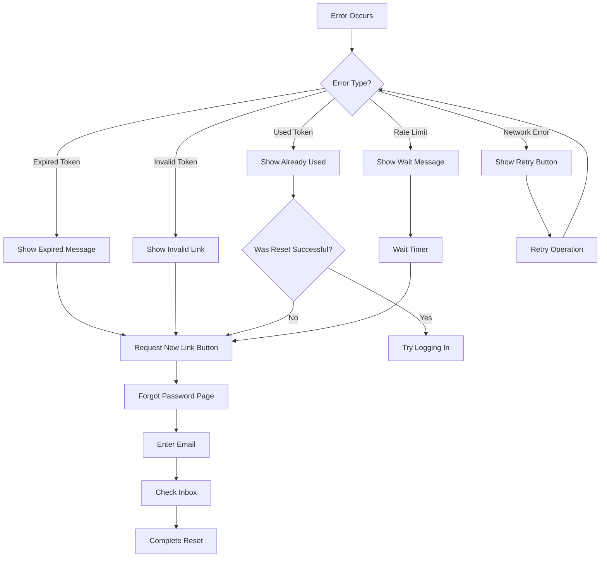
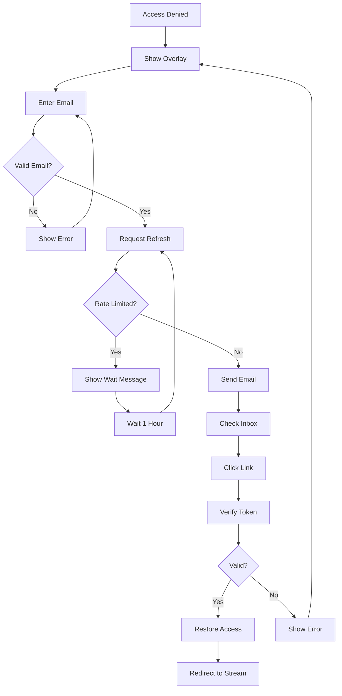

# 🔄 Error Recovery & Edge Case Handling Guide

**Date:** January 11, 2026  
**Purpose:** Comprehensive guide for handling errors and edge cases in authentication workflows

---

## 🎯 Overview

This document details how the system handles errors and edge cases in:
1. Password Reset Flow
2. Viewer Refresh Flow
3. Network & Database Errors
4. Rate Limiting & Security

---

## 🔐 Password Reset Error Scenarios

### 1. Email Not Found

**Scenario:** User requests reset for non-existent email

**Handling:**
```typescript
// ✅ Security-first approach (email enumeration protection)
return {
  success: true,
  message: 'If an account exists with that email, you will receive a password reset link.'
};
```

**Why:**
- Prevents email enumeration attacks
- Protects user privacy
- OWASP recommended practice

**User Experience:**
- Same success message for all requests
- User doesn't know if email exists
- Can check their inbox

**Recovery:** None needed - by design

---

### 2. Rate Limit Exceeded

**Scenario:** User makes 4+ requests in 1 hour

**Detection:**
```typescript
const count = await repo.countActiveByIdentityAndStream(
  viewerIdentityId,
  directStreamId,
  gameId
);

if (count >= MAX_REQUESTS_PER_HOUR) {
  return {
    success: false,
    message: 'Too many password reset requests. Please try again later.',
    error: 'RATE_LIMIT_EXCEEDED'
  };
}
```

**User Experience:**
- Clear error message
- Explanation of wait time
- "Try again later" instruction

**Recovery Options:**
1. Wait 1 hour for automatic reset
2. Contact support if urgent
3. Use alternative authentication method

**Backend Recovery:**
```bash
# Manual rate limit reset (emergency only)
psql $DATABASE_URL -c "
  DELETE FROM \"PasswordResetToken\"
  WHERE email = 'user@example.com'
  AND \"createdAt\" < NOW() - INTERVAL '1 hour';
"
```

---

### 3. Expired Token

**Scenario:** User clicks reset link after 15 minutes (owner) or 10 minutes (admin)

**Detection:**
```typescript
const token = await repo.findByTokenHash(tokenHash);

if (!token || token.expiresAt < new Date()) {
  return {
    valid: false,
    message: 'Password reset link has expired. Please request a new one.',
    error: 'TOKEN_EXPIRED'
  };
}
```

**User Experience:**
- Clear "Link Expired" message
- "Request New Link" button
- Auto-redirects to forgot password page

**Recovery:**
1. Click "Request New Link"
2. Enter email again
3. Check inbox for new link
4. Complete reset within time limit

**Prevention:**
- Email includes expiry time
- Clear urgency messaging
- Mobile notifications (if enabled)

---

### 4. Token Already Used

**Scenario:** User clicks reset link twice

**Detection:**
```typescript
if (token.usedAt) {
  return {
    valid: false,
    message: 'This password reset link has already been used.',
    error: 'TOKEN_ALREADY_USED'
  };
}
```

**User Experience:**
- Clear "Already Used" message
- Option to request new link
- Security explanation

**Recovery:**
1. If password was reset: Try logging in
2. If not reset: Request new link
3. Contact support if confused

**Security Benefit:**
- Prevents token reuse attacks
- Detects potential interception
- Audit trail maintained

---

### 5. Password Validation Failure

**Scenario:** User enters weak password

**Validation:**
```typescript
const requirements = {
  minLength: password.length >= 8,
  hasUpper: /[A-Z]/.test(password),
  hasLower: /[a-z]/.test(password),
  hasNumber: /\d/.test(password),
  hasSpecial: /[!@#$%^&*(),.?":{}|<>]/.test(password)
};

const allMet = Object.values(requirements).every(Boolean);
if (!allMet) {
  throw new Error('Password does not meet requirements');
}
```

**User Experience:**
- Real-time validation feedback
- Visual requirement checklist
- Strength indicator (Weak/Fair/Good/Strong)
- Helpful suggestions

**Recovery:**
- Update password in real-time
- See validation update live
- Submit only when valid

**Prevention:**
- Frontend validation prevents submission
- Backend validation as backup
- Clear requirement display

---

### 6. Password Mismatch

**Scenario:** Confirm password doesn't match

**Validation:**
```typescript
if (newPassword !== confirmPassword) {
  throw new Error("Passwords don't match");
}
```

**User Experience:**
- Inline error on confirm field
- Red highlight on mismatch
- Clear error message

**Recovery:**
- Re-enter confirm password
- Or update new password
- Submit when matched

---

### 7. Network Error During Submit

**Scenario:** User loses connection during password reset

**Handling:**
```typescript
try {
  const response = await apiRequest('/api/auth/password-reset/confirm', {
    method: 'POST',
    body: { token, newPassword }
  });
} catch (error) {
  if (error instanceof NetworkError) {
    setError('Network error. Please check your connection and try again.');
  }
}
```

**User Experience:**
- "Network Error" message
- "Try Again" button
- Loading state cleared

**Recovery:**
1. Check internet connection
2. Click "Try Again"
3. If persists, request new token
4. Contact support if urgent

**Backend Safety:**
- Transaction rollback on failure
- Token remains valid until used
- No partial state saved

---

## 🎬 Viewer Refresh Error Scenarios

### 1. Viewer Not Found

**Scenario:** Refresh requested for non-registered viewer

**Handling:**
```typescript
const viewerIdentity = await identityRepo.findByEmail(email);

if (!viewerIdentity) {
  // Create new viewer identity for future use
  const newIdentity = await identityRepo.create({
    email,
    firstName: null,
    lastName: null
  });
}

// Still send refresh email (creates access)
```

**User Experience:**
- Same success message
- Email sent with access link
- Seamless registration

**Recovery:** None needed - automatic

---

### 2. Stream Not Found

**Scenario:** Refresh requested for deleted/invalid stream

**Handling:**
```typescript
if (directStreamId) {
  const stream = await streamRepo.findById(directStreamId);
  if (!stream) {
    return {
      success: false,
      message: 'The requested stream is no longer available.',
      error: 'STREAM_NOT_FOUND'
    };
  }
}
```

**User Experience:**
- Clear "Stream Unavailable" message
- Link to browse other streams
- Contact organizer option

**Recovery:**
1. Browse available streams
2. Contact stream organizer
3. Check for rescheduled stream

---

### 3. Token Verification Network Error

**Scenario:** User clicks verify link but API fails

**Handling:**
```typescript
// Frontend with retry logic
const verifyWithRetry = async (token: string, retries = 3) => {
  for (let i = 0; i < retries; i++) {
    try {
      return await apiRequest(`/api/auth/viewer-refresh/verify`, {
        method: 'POST',
        body: { token }
      });
    } catch (error) {
      if (i === retries - 1) throw error;
      await new Promise(resolve => setTimeout(resolve, 1000 * (i + 1)));
    }
  }
};
```

**User Experience:**
- Verifying state persists
- Automatic retry (3 attempts)
- Error after all retries fail
- "Try Again" button

**Recovery:**
1. Automatic retry (transparent)
2. Manual "Try Again"
3. Check network connection
4. Request new link if expired

---

### 4. Redirect URL Invalid

**Scenario:** Viewer verifies but redirect URL is malformed

**Handling:**
```typescript
// Validate redirect URL before using
const isValidRedirect = (url: string | null): boolean => {
  if (!url) return false;
  try {
    const parsed = new URL(url, BASE_URL);
    return parsed.origin === BASE_URL;
  } catch {
    return false;
  }
};

if (!isValidRedirect(result.redirectUrl)) {
  // Fallback to stream page or home
  router.push('/direct');
}
```

**User Experience:**
- Successful verification
- Safe fallback redirect
- No error shown

**Recovery:** Automatic (transparent)

---

## 💾 Database Error Scenarios

### 1. Connection Lost

**Scenario:** Database connection drops during operation

**Handling:**
```typescript
// Prisma automatic retry
datasources: {
  db: {
    provider: "postgresql",
    url: env("DATABASE_URL"),
    relationMode: "prisma"
  }
}

// Manual retry logic
const withRetry = async <T>(
  operation: () => Promise<T>,
  maxRetries = 3
): Promise<T> => {
  for (let i = 0; i < maxRetries; i++) {
    try {
      return await operation();
    } catch (error) {
      if (i === maxRetries - 1) throw error;
      await new Promise(resolve => setTimeout(resolve, 1000));
    }
  }
  throw new Error('Max retries exceeded');
};
```

**User Experience:**
- Loading state persists
- Automatic retry (transparent)
- Generic error if all retries fail

**Recovery:**
1. Automatic retry (Prisma + custom)
2. User can try again manually
3. Contact support if persists

**Backend Alert:**
- Log connection errors
- Alert on repeated failures
- Check database health

---

### 2. Constraint Violation

**Scenario:** Duplicate token created (extremely rare)

**Handling:**
```typescript
try {
  const token = await repo.create({
    tokenHash,
    email,
    userType,
    expiresAt
  });
} catch (error) {
  if (error.code === 'P2002') { // Unique constraint
    // Regenerate token and retry
    return generateAndCreateToken();
  }
  throw error;
}
```

**User Experience:**
- Transparent (automatic retry)
- No error shown
- Success as normal

**Recovery:** Automatic

---

### 3. Transaction Rollback

**Scenario:** Multi-step operation fails mid-way

**Handling:**
```typescript
// Prisma transaction ensures atomicity
await prisma.$transaction(async (tx) => {
  // 1. Mark token as used
  await tx.passwordResetToken.update({
    where: { id: token.id },
    data: { usedAt: new Date() }
  });

  // 2. Update user password
  await tx.ownerUser.update({
    where: { id: userId },
    data: {
      passwordHash: newPasswordHash,
      lastPasswordResetAt: new Date()
    }
  });

  // 3. Invalidate sessions
  await tx.ownerSession.deleteMany({
    where: { userId }
  });
});
// If any step fails, all rollback automatically
```

**User Experience:**
- Either full success or full failure
- No partial state
- Clear error message

**Recovery:**
- User retries entire operation
- Token remains valid (not marked as used)
- Safe to retry

---

## 🌐 Network Error Scenarios

### 1. API Timeout

**Scenario:** Request takes > 30 seconds

**Handling:**
```typescript
// Frontend timeout configuration
const apiRequest = async (url: string, options: RequestOptions) => {
  const controller = new AbortController();
  const timeoutId = setTimeout(() => controller.abort(), 30000);

  try {
    const response = await fetch(url, {
      ...options,
      signal: controller.signal
    });
    clearTimeout(timeoutId);
    return response;
  } catch (error) {
    clearTimeout(timeoutId);
    if (error.name === 'AbortError') {
      throw new Error('Request timeout. Please try again.');
    }
    throw error;
  }
};
```

**User Experience:**
- Loading state for up to 30s
- "Request Timeout" error after 30s
- "Try Again" button

**Recovery:**
1. Click "Try Again"
2. Check network speed
3. Try different network
4. Contact support if persists

---

### 2. Slow Connection

**Scenario:** User on slow 3G/4G connection

**Handling:**
```typescript
// Frontend: Show loading indicators
// Backend: Optimize response size
// Email: Include retry instructions
```

**User Experience:**
- Extended loading state
- Progress indicators
- Patient messaging

**Recovery:**
- Wait for completion
- Switch to better network
- Use desktop instead of mobile

---

### 3. CORS Error

**Scenario:** Frontend makes request from unexpected origin

**Handling:**
```typescript
// Backend CORS configuration
app.use(cors({
  origin: process.env.CORS_ORIGIN || 'http://localhost:4300',
  credentials: true
}));
```

**User Experience:**
- Console error (developer)
- Generic network error (user)

**Recovery:**
- Fix CORS configuration
- Deploy with correct origin
- Test in production domain

---

## 📧 Email Error Scenarios

### 1. Email Delivery Failure

**Scenario:** SendGrid/SMTP fails to send

**Handling:**
```typescript
try {
  await emailProvider.sendEmail({
    to: email,
    subject,
    html,
    text
  });
  logger.info(`Password reset email sent to ${email}`);
} catch (error) {
  logger.error({ error }, `Failed to send email to ${email}`);
  // Still return success to user (email enumeration protection)
  // But alert dev team
}
```

**User Experience:**
- Success message (security)
- User waits for email
- May not receive it

**Recovery:**
1. User waits 5-10 minutes
2. Check spam folder
3. Request new link
4. Contact support

**Backend Alert:**
- Log email failures
- Alert on repeated failures
- Check email provider status
- Check API key validity

---

### 2. Invalid Email Address

**Scenario:** User enters invalid email format

**Handling:**
```typescript
// Frontend validation (Zod)
const emailSchema = z.string().email('Invalid email address');

// Backend validation (redundant)
const result = emailSchema.safeParse(email);
if (!result.success) {
  throw new BadRequestError('Invalid email address');
}
```

**User Experience:**
- Inline error on blur
- Red highlight
- Submit button disabled

**Recovery:**
- Correct email format
- See validation update live
- Submit when valid

---

### 3. Email Bounces

**Scenario:** Email address doesn't exist (hard bounce)

**Handling:**
```typescript
// SendGrid webhook for bounces
app.post('/webhooks/sendgrid', (req, res) => {
  const events = req.body;
  events.forEach(event => {
    if (event.event === 'bounce' && event.type === 'hard') {
      logger.warn(`Hard bounce for ${event.email}`);
      // Optionally: Mark email as invalid in DB
    }
  });
  res.sendStatus(200);
});
```

**User Experience:**
- User waits for email
- Email never arrives
- Must request new link

**Recovery:**
1. Check email address
2. Try different email
3. Contact support

---

## 🔄 Recovery Workflows

### Password Reset Recovery



### Viewer Refresh Recovery



---

## 📊 Error Monitoring

### Metrics to Track

| Metric | Threshold | Action |
|--------|-----------|--------|
| **Token Expiry Rate** | > 50% | Increase expiry time |
| **Email Bounce Rate** | > 5% | Investigate email provider |
| **Network Error Rate** | > 10% | Check API health |
| **Rate Limit Hit Rate** | > 20% | Review limits |
| **Password Validation Failure** | > 30% | Improve UX guidance |

### Logging Strategy

```typescript
// Success events (INFO)
logger.info('Password reset requested', { email, userType, ip });
logger.info('Password reset completed', { userId, ip });

// Warning events (WARN)
logger.warn('Rate limit exceeded', { email, ip, attempt: 4 });
logger.warn('Token expired', { tokenId, age: '20 minutes' });

// Error events (ERROR)
logger.error('Email delivery failed', { email, error });
logger.error('Database connection lost', { error, retry: 1 });
```

---

## 🎯 User Communication

### Error Message Best Practices

**✅ Good Error Messages:**
- "Your password reset link has expired. Please request a new one."
- "Too many requests. Please try again in 1 hour."
- "Network error. Please check your connection."

**❌ Bad Error Messages:**
- "Token not found in database"
- "Error: ERR_CONNECTION_REFUSED"
- "Something went wrong"

**Guidelines:**
1. **User-friendly language** (no tech jargon)
2. **Clear action** (what user should do)
3. **No sensitive info** (security)
4. **Helpful context** (why it failed)

---

**Robust error handling ensures great user experience even when things go wrong!** 🔄

